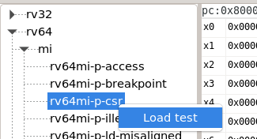
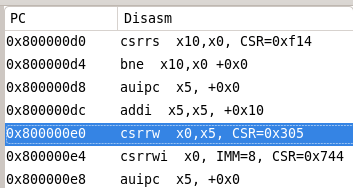
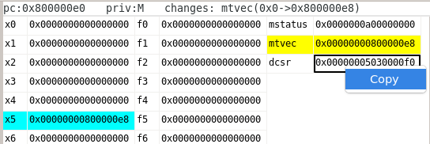
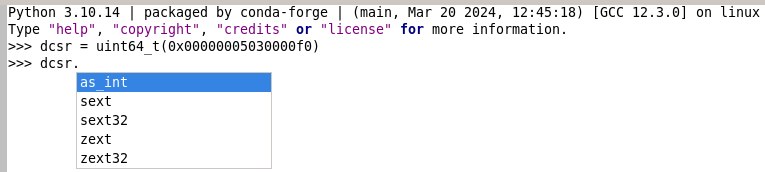
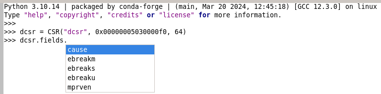
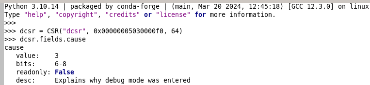
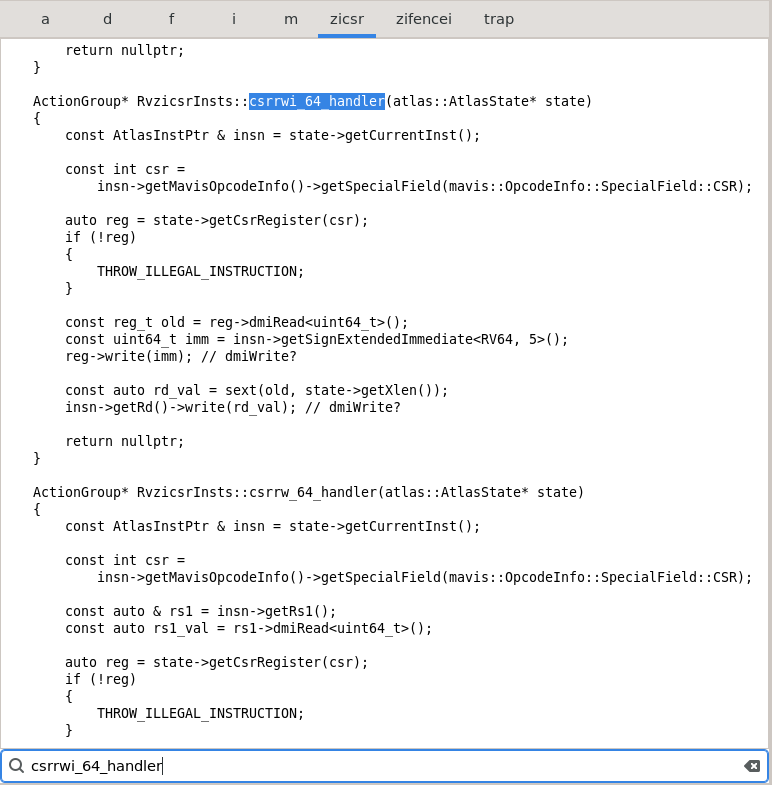

# Python IDE for Pegasus Simulators
Debug C++ Pegasus simulations easier without gdb.

## Launch
You must setup your environment and build Pegasus first. From the Pegasus root directory:

```
conda activate sparta
mkdir release
cd release
cmake .. -DCMAKE_BUILD_TYPE=Release
make
```

Now you can open the IDE with the following command:

```
python3 IDE/PegasusIDE.py --riscv-tests-dir <path/to/extracted/riscv/tests> --sim-exe-path ./release/sim/pegasus
```

## UI Components

### Test Selector
Only one test can be opened in the IDE at a time. Tests must be loaded from the right-click menu.



### Instruction Viewer

View the disassembly and PC for every instruction executed. Clicking on any row will display the Pegasus state at this PC after the instruction was executed.



### State Viewer
See all the INT/FP/CSR values, the privilege mode, and any changes to register values at this PC. Changed registers will be highlighted in yellow, while any non-zero registers will be highlighted in blue.

Note that in order to save screen space, the CSR table only shows non-zero CSRs. You may right-click on the register values to copy the value to the clipboard:



### Python Shell
The IDE provides a Python shell to make it easier to debug bit operations or field mask issues, prototyping instruction handlers, and viewing CSR field values. After copying a CSR from the right-click menu above, paste it into the shell to inspect the CSR and its fields:





Note that for the methods below, if the bit position argument should be XLEN, there is an 'xlen' variable (32 or 64) put in the Python shell workspace automatically when a test is loaded.

- as_int()
    - Get the raw underlying integer value (not hex).

- sext(pos)
    - Sign-extends an integer with a specified bit position.

- sext32()
    - Sign-extends a 32-bit signed integer to 64 bits.

- zext(pos)
    - Zero-extend an integer with a specified bit position.

- zext32():
    - Zero-extend a 32-bit unsigned integer to 64 bits.

### Code Viewer
View all instruction handlers and exception handler code.


