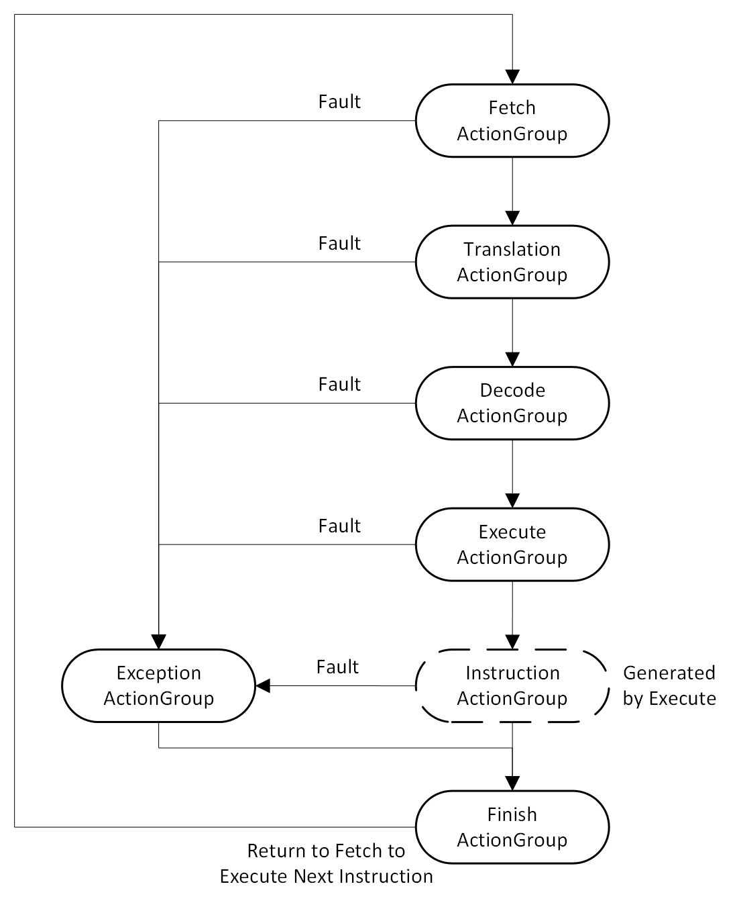

= Atlas RISC-V Functional Model
Kathlene Magnus <kathlene.hurt@gmail.com>
:reproducible:
:listing-caption: Listing
:source-highlighter: rouge
:toc:
:title-page: Atlas RISC-V Functional Model

== Introduction

Atlas is an open-source RISC-V functional model built using the Sparta modeling framework.

== Actions and Action Groups

The Atlas functional model is driven by executing series of Actions collected into groups called
Action Groups. An Action is a functor that represents an independent portion of work that is
executed by Atlas, like decoding an opcode or writing to an instruction log. Breaking up the Atlas
engine into Actions allows the model to modularly modify itself to run more efficiently.

Atlas's core engine is comprised of 7 Action Groups:
* Fetch
* Instruction Translation
* Decode
* Execute
* Data Translation
* Exception
* Finish

Instruction Action Groups are generated by the Execute Unit as needed by the running program.

TODO: Pseudo-code for an Action
TODO: How to execute an ActionGroup
TODO: How to loop through a series of connected ActionGroups
